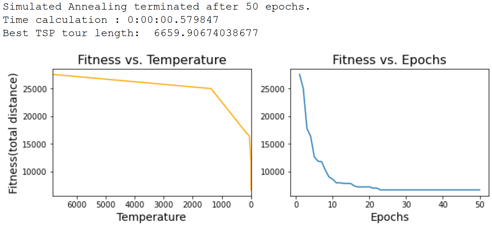
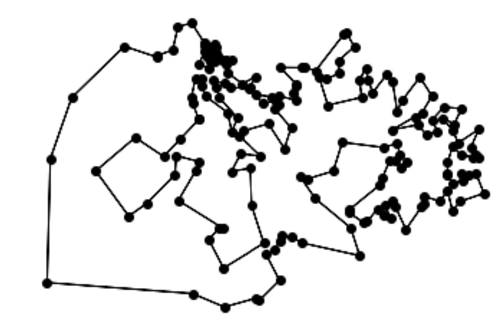

# Part 1 : Travelling Saleman Problem

In this part, we use "satsp" package (version 0.9) to solve the TSP problem.

- Algorithm : 
There are a couple of algorithms and implementations out there for discrete optimization. **Simulated annealing** is one of the straightforward  algorithm to solve this kind of the "blob" enigma. Thanks to the simplicity of the algorithm and its implementation, a compromise between the time calculation and the performance can be satisfied. Indeed, a good result (low fitness) can be reached out with a short calculation time. Finally, the algorithm was found to be very stable and consistent for each run.  

- Install the package by the command :

```
pip install satsp
```
- Set of cities : we investigate Djibouti (38 cities) and Qatar (192 cities) from http://www.math.uwaterloo.ca/tsp/world/countries.html#DJ. They are saved into "TSP_DJB.tsp" and "TSP_QT.tsp" files. 

- Parameters : the mainsteam parameters of simulated annealing are temperatures and cooling rate (alpha). Here we tune the number of epochs which is a stopping criteria or a running time, and it is somehow equivalent to given temperatures. The "best" resutls are shown after a couple of runs.     

- Benchmark : 
   - For a dimension of 38, the best path (lowest distance) was obtained after about 23 epochs with a cooling rate of 0.2 and number of epoch iterations (epoch_length) = 100. Total time of calculation = 0.58s (over 50 epochs).
   
   



   
   - For a dimension of 194, the best path (lowest distance) was obtained after about 100 epochs with a cooling rate of 0.4 and number of epoch iterations (epoch_length) = 500. Total time of calculation = 21.1s (over 200 epochs).
   
   





   - The solution vectors can be found in the notebook (*Best TSP tour*). 
